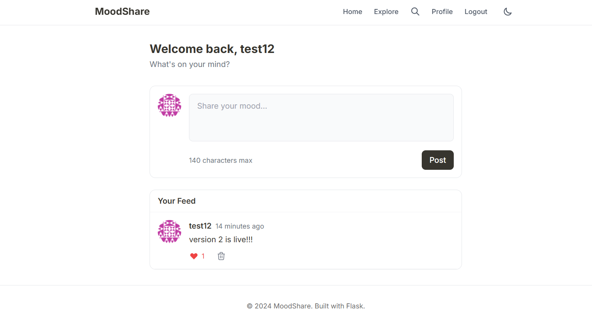

# MoodShare

A modern, minimalist social networking platform for sharing thoughts and moods. Built with Flask and styled with Tailwind CSS.


## Features

- **User Authentication** - Secure registration, login, and logout with password hashing
- **Password Reset** - Email-based password recovery using JWT tokens
- **User Profiles** - Customizable profiles with Gravatar integration
- **Posts** - Share your mood in 140 characters (classic Twitter style)
- **Likes** - Like and unlike posts with real-time count updates
- **Follow System** - Follow users to see their posts in your personalized feed
- **Search** - Find users and posts instantly
- **Dark Mode** - Toggle between light and dark themes with persistence
- **REST API** - Full JSON API for mobile apps and SPAs
- **Responsive Design** - Works seamlessly on desktop and mobile

## Tech Stack

| Layer              | Technology                          |
| ------------------ | ----------------------------------- |
| **Backend**        | Python 3.9+, Flask 2.3              |
| **Database**       | SQLAlchemy ORM, SQLite / PostgreSQL |
| **Frontend**       | Tailwind CSS, Jinja2 Templates      |
| **Authentication** | Flask-Login, JWT Tokens             |
| **Forms**          | Flask-WTF with CSRF Protection      |
| **API**            | RESTful JSON API with JWT Auth      |
| **Testing**        | Pytest with Coverage                |

## Screenshots

<table>
  <tr>
    <td></td>
    <td></td>
  </tr>
  <tr>
    <td align="center"><b>Dark Mode</b></td>
    <td align="center"><b>Light Mode</b></td>
  </tr>
</table>

## Quick Start

### Prerequisites

- Python 3.9 or higher
- pip (Python package manager)

### Installation

```bash
# Clone the repository
git clone https://github.com/ritiksharma04/moodshare.git
cd moodshare/moodshare

# Create virtual environment
python -m venv venv

# Activate virtual environment
# Windows:
venv\Scripts\activate
# macOS/Linux:
source venv/bin/activate

# Install dependencies
pip install -r requirements.txt

# Set up environment variables
cp .env.example .env
# Edit .env with your SECRET_KEY

# Initialize database
set FLASK_APP=microblog.py    # Windows
export FLASK_APP=microblog.py # macOS/Linux
flask db upgrade

# Run the application
flask run
```

Visit `http://localhost:5000` in your browser.

## Project Structure

```
moodshare/
├── app/
│   ├── __init__.py       # App factory & extensions
│   ├── routes.py         # Web routes
│   ├── api.py            # REST API endpoints
│   ├── models.py         # Database models
│   ├── forms.py          # WTF Forms
│   ├── email.py          # Email utilities
│   ├── errors.py         # Error handlers
│   ├── static/css/       # Stylesheets
│   └── templates/        # Jinja2 templates
├── tests/
│   ├── conftest.py       # Pytest fixtures
│   ├── test_models.py    # Model tests
│   └── test_routes.py    # Route tests
├── migrations/           # Database migrations
├── config.py             # Configuration
├── microblog.py          # Entry point
└── requirements.txt      # Dependencies
```

## REST API

Full REST API with JWT authentication for building mobile apps or SPAs.

### Authentication

```bash
# Get JWT token
curl -X POST http://localhost:5000/api/auth/login \
  -H "Content-Type: application/json" \
  -d '{"username": "youruser", "password": "yourpass"}'

# Response
{
  "token": "eyJ0eXAiOiJKV1QiLCJhbGciOiJIUzI1NiJ9...",
  "expires_in": 86400,
  "user": { "id": 1, "username": "youruser", ... }
}
```

### Endpoints

| Method   | Endpoint               | Description           | Auth  |
| -------- | ---------------------- | --------------------- | ----- |
| `POST`   | `/api/auth/login`      | Get JWT token         | No    |
| `GET`    | `/api/posts`           | List all posts        | Token |
| `POST`   | `/api/posts`           | Create a post         | Token |
| `GET`    | `/api/posts/:id`       | Get single post       | Token |
| `DELETE` | `/api/posts/:id`       | Delete post           | Token |
| `POST`   | `/api/posts/:id/like`  | Like a post           | Token |
| `DELETE` | `/api/posts/:id/like`  | Unlike a post         | Token |
| `GET`    | `/api/users/:id`       | Get user profile      | Token |
| `GET`    | `/api/users/:id/posts` | Get user's posts      | Token |
| `GET`    | `/api/me`              | Get current user      | Token |
| `GET`    | `/api/feed`            | Get personalized feed | Token |

### Example Usage

```bash
# Create a post
curl -X POST http://localhost:5000/api/posts \
  -H "Authorization: Bearer YOUR_TOKEN" \
  -H "Content-Type: application/json" \
  -d '{"body": "Hello from the API!"}'

# Like a post
curl -X POST http://localhost:5000/api/posts/1/like \
  -H "Authorization: Bearer YOUR_TOKEN"

# Get your feed
curl http://localhost:5000/api/feed \
  -H "Authorization: Bearer YOUR_TOKEN"
```

## Testing

```bash
# Run all tests
pytest tests/ -v

# Run with coverage report
pytest tests/ --cov=app --cov-report=html

# Run specific test file
pytest tests/test_models.py -v
```

## Database Migrations

```bash
# Create a new migration after model changes
flask db migrate -m "Description of changes"

# Apply migrations
flask db upgrade

# Rollback last migration
flask db downgrade
```

## Key Concepts

### Database Design

- **One-to-Many**: User → Posts
- **Many-to-Many**: User ↔ User (followers), User ↔ Post (likes)
- **Self-referential**: Followers relationship on User model

### Security

- Password hashing with Werkzeug
- CSRF protection on all forms
- JWT tokens for API authentication
- Authorization checks (users can only delete own posts)

### Modern Frontend

- Tailwind CSS utility-first styling
- CSS custom properties for theming
- Dark mode with localStorage persistence
- Responsive mobile-first design

## Environment Variables

| Variable        | Description                   | Default            |
| --------------- | ----------------------------- | ------------------ |
| `SECRET_KEY`    | Flask secret key for sessions | Required           |
| `DATABASE_URL`  | Database connection string    | `sqlite:///app.db` |
| `MAIL_SERVER`   | SMTP server for emails        | Optional           |
| `MAIL_PORT`     | SMTP port                     | `587`              |
| `MAIL_USERNAME` | SMTP username                 | Optional           |
| `MAIL_PASSWORD` | SMTP password                 | Optional           |

## Contributing

1. Fork the repository
2. Create your feature branch (`git checkout -b feature/amazing-feature`)
3. Commit your changes (`git commit -m 'Add amazing feature'`)
4. Push to the branch (`git push origin feature/amazing-feature`)
5. Open a Pull Request

## License

This project is open source and available under the [MIT License](LICENSE).

---

<p align="center">
  Built with Flask by <a href="https://github.com/ritiksharma04">Ritik</a>
</p>
